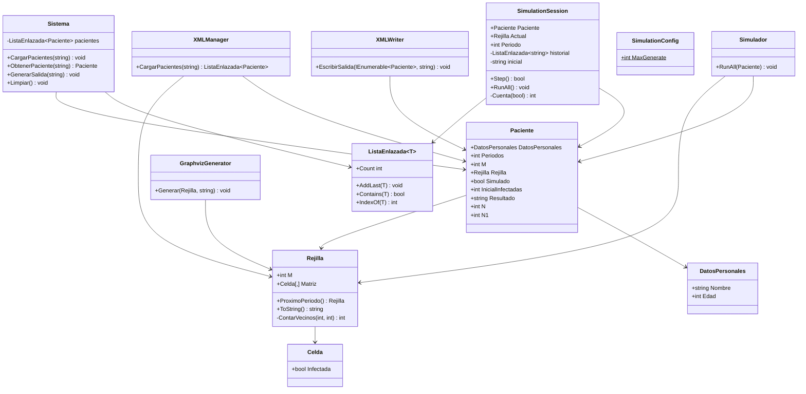
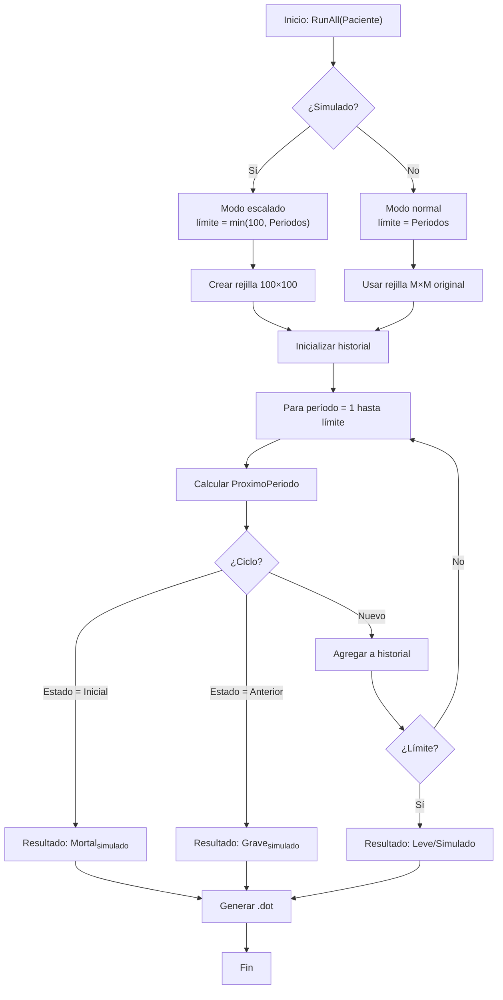
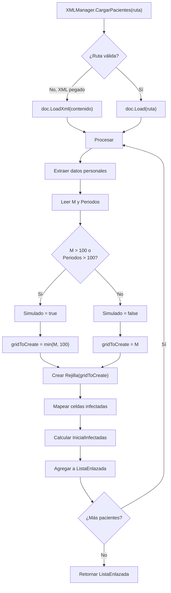
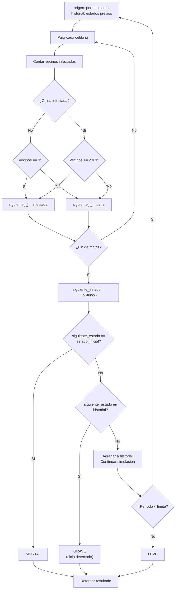

# Manual Técnico - Simulador de Rejillas Epidemiológicas

## 1. Introducción

El **Simulador de Rejillas Epidemiológicas** es una aplicación desarrollada en C# (.NET 10.0) que simula la propagación de enfermedades infecciosas en una población representada como una matriz bidimensional (rejilla). El sistema implementa un autómata celular basado en el juego de la vida de Conway, adaptado para modelar dinámicas epidemiológicas.

### Objetivo General
Modelar y simular la evolución de un patrón de infección en rejillas de cualquier tamaño, permitiendo identificar si la enfermedad tiende a evolucionar sin control (resultado mortal), a entrar en ciclos predecibles (resultado grave), o a comportarse de manera controlable (resultado leve).

### Características Principales
- Carga de datos de pacientes desde archivos XML
- Simulación a escala para entradas grandes (> 100×100 o > 100 períodos)
- Generación automática de visualizaciones Graphviz
- Exportación de resultados en formato XML
- Interfaz interactiva en consola con múltiples opciones de simulación

---

## 2. Arquitectura del Sistema

### 2.1 Estructura de Capas

```
┌─────────────────────────────────────┐
│     Interface de Usuario (CLI)      │  Program.cs
│         Menú Interactivo            │
└────────────────┬────────────────────┘
                 │
┌────────────────▼────────────────────┐
│        Capa de Simulación           │  Sistema/
│   Simulador, SimulationSession      │  Sistema.cs
└────────────────┬────────────────────┘
                 │
┌────────────────▼────────────────────┐
│     Capa de Modelos de Datos        │  Modelos/
│  Paciente, Rejilla, Celda           │
└────────────────┬────────────────────┘
                 │
┌────────────────▼────────────────────┐
│      Capa de Utilidades             │  Utilidades/
│  XMLManager, XMLWriter, Graphviz    │
└─────────────────────────────────────┘
```

### 2.2 Estructura de Directorios

```
IPC2_Proyecto1_2020XXXX/
├── Modelos/                    # Clases de datos
│   ├── Celda.cs
│   ├── Paciente.cs
│   └── Rejilla.cs
├── Estructuras/               # Estructuras personalizadas
│   ├── ListaEnlazada.cs
│   └── Nodo.cs
├── Sistema/                   # Lógica de simulación
│   ├── Simulador.cs
│   ├── SimulationSession.cs
│   └── Sistema.cs
├── Utilidades/               # Herramientas auxiliares
│   ├── XMLManager.cs
│   ├── XMLWriter.cs
│   ├── GraphvizGenerator.cs
│   └── SimulationConfig.cs
├── ArchivosEntrada/         # Archivos XML entrada
├── ArchivosSalida/          # Salidas generadas
└── Program.cs              # Punto de entrada
```

---

## 3. Descripción de Componentes

### 3.1 Capa de Modelos

#### Clase `Celda`
Representa una celda individual en la rejilla epidemiológica.
```csharp
public class Celda
{
    public bool Infectada { get; set; } = false;
}
```
- **Propiedad**: `Infectada` - booleano que indica si la celda está infectada (true) o sana (false)

#### Clase `Rejilla`
Modela una matriz cuadrada M×M de celdas y contiene la lógica del autómata celular.
```csharp
public class Rejilla
{
    public int M { get; set; }              // Dimensión de la rejilla
    public Celda[,] Matriz { get; set; }    // Matriz cuadrada
    
    public Rejilla ProximoPeriodo()         // Calcula estado siguiente
    public override string ToString()       // Serializa estado actual
}
```

**Algoritmo de Transición de Estados** (ProximoPeriodo):
- Para cada celda (i,j):
  - Contar vecinos infectados (8 vecinos adyacentes)
  - **Si está infectada**: sobrevive si tiene 2 o 3 vecinos infectados
  - **Si está sana**: se infecta si tiene exactamente 3 vecinos infectados
  - Generar nueva rejilla con estos cambios

#### Clase `Paciente`
Encapsula los datos de un paciente y sus resultados de simulación.
```csharp
public class Paciente
{
    public DatosPersonales DatosPersonales { get; set; }
    public int M { get; set; }              // Dimensión rejilla
    public int Periodos { get; set; }       // Máximo periodos a simular
    public Rejilla? Rejilla { get; set; }   // Rejilla actual
    public bool Simulado { get; set; }      // Modo escala activado
    public string? Resultado { get; set; }  // "mortal", "grave", "leve", "simulado"
    public int N { get; set; }              // Período en que ocurre evento
    public int N1 { get; set; }             // Longitud del ciclo (si aplica)
}
```

### 3.2 Capa de Simulación

#### Clase `Simulador`
Ejecuta la simulación completa con manejo de modo escalado.

**Método `RunAll(Paciente paciente)`**:
1. Verifica si `paciente.Simulado == true`
2. **Modo Simulado**: Ejecuta hasta 100 períodos en una rejilla de max 100×100
   - Mapea las coordenadas ingresadas a la rejilla reducida
   - Detecta ciclos en escala
   - Marca resultado como "mortal_simulado", "grave_simulado" o "simulado"
3. **Modo Normal**: Ejecución completa (si M ≤ 100 y Periodos ≤ 100)
   - Itera hasta encontrar ciclo o alcanzar límite
   - Genera archivos .dot para cada período

**Detección de Patrones**:
- **Mortal**: Estado actual = estado inicial → ciclo de período 1
- **Grave**: Estado actual coincide con estado anterior no inicial → ciclo mayor
- **Leve**: Alcanza límite de períodos sin ciclo

#### Clase `SimulationSession`
Permite ejecución paso a paso de la simulación.
```csharp
public class SimulationSession
{
    public bool Step()       // Avanza un período
    public void RunAll()     // Ejecuta hasta terminar
}
```

### 3.3 Capa de Utilidades

#### Clase `XMLManager`
Carga datos de pacientes desde XML.
- Detecta si la entrada es una ruta o contenido XML pegado
- Cuando el tamaño supera `SimulationConfig.MaxGenerate (100)`:
  - Activa modo simulado
  - Mapea celdas a rejilla reducida: `idxF = floor((f-1) * targetM / m)`
- Manejo robusto de excepciones

#### Clase `XMLWriter`
Exporta resultados a XML con estructura similar a la entrada.

#### Clase `GraphvizGenerator`
Genera archivos .dot para visualizar rejillas con Graphviz.
- Celda sana: blanca
- Celda infectada: roja

#### Clase `SimulationConfig`
```csharp
public static class SimulationConfig
{
    public const int MaxGenerate = 100;  // Umbral para activar modo simulado
}
```

### 3.4 Estructuras Personalizadas

#### Clase `ListaEnlazada<T>`
Lista enlazada genérica implementada manualmente.
- Usado para almacenar pacientes y estados históricos
- Métodos: `AddLast()`, `Contains()`, `IndexOf()`, `Count`

---

## 4. Algoritmos Principales

### 4.1 Algoritmo de Propagación (Autómata Celular)

**Entrada**: Rejilla actual M×M, reglas de infección
**Salida**: Rejilla siguiente generación

```
Pseudocódigo:
función ProximoPeriodo():
    siguienteRejilla ← Rejilla nueva (M×M)
    para cada celda (i,j) en rejilla actual:
        infectados ← ContarVecinos(i,j)
        si rejilla[i,j].Infectada:
            si infectados == 2 o infectados == 3:
                siguienteRejilla[i,j].Infectada ← true
            sino:
                siguienteRejilla[i,j].Infectada ← false
        sino:
            si infectados == 3:
                siguienteRejilla[i,j].Infectada ← true
            sino:
                siguienteRejilla[i,j].Infectada ← false
    retorna siguienteRejilla
```

**Complejidad**: O(M²) por período (8 vecinos por celda)

### 4.2 Algoritmo de Detección de Ciclos

**Entrada**: Secuencia de estados, límite máximo de períodos
**Salida**: Tipo de resultado (mortal, grave, leve)

```
Pseudocódigo:
función DetectarCiclo(estadoInicial, historial, maxPeriodos):
    para periodo = 1 hasta maxPeriodos:
        estadoActual ← ProximoPeriodo()
        
        si estadoActual == estadoInicial:
            retorna "mortal" (período = 1)
        
        si estadoActual en historial:
            indiceAurora ← IndexOf(estadoActual)
            N1 ← periodo - indiceAurora
            retorna "grave" (ciclo de longitud N1)
        
        historial.Agregar(estadoActual)
    
    retorna "leve" (sin ciclo detectado)
```

**Complejidad**: O(P × M²) donde P es el número de períodos

### 4.3 Algoritmo de Mapeo para Simulación Escalada

Cuando el tamaño de entrada excede el umbral (100):
```
Para cada celda infectada en posición (f, c) original en rejilla m×m:
    targetM ← min(m, 100)
    idxF ← floor((f - 1) × targetM / m)
    idxC ← floor((c - 1) × targetM / m)
    Asegurar: 0 ≤ idxF < targetM y 0 ≤ idxC < targetM
    Marcar rejilla_pequeña[idxF, idxC] como infectada
```

---

## 5. Flujo de Ejecución

```
Inicio
  ↓
Mostrar Menú Principal
  ↓
┌─────────────────────────────────┐
│ Opción 1: Cargar XML            │
│ - Leer ruta o pegar contenido   │
│ - XMLManager.CargarPacientes()  │
│ - Crear Rejilla (normal/escalada)
└─────────────────────────────────┘
  ↓
┌─────────────────────────────────┐
│ Opción 2: Elegir Paciente       │
│ - Crear SimulationSession       │
└─────────────────────────────────┘
  ↓
┌─────────────────────────────────┐
│ Opción 3/4: Simular             │
│ - Step(): Avanzo 1 período      │
│ - RunAll(): Todos los períodos  │
│ → Generar .dot, .png            │
└─────────────────────────────────┘
  ↓
┌─────────────────────────────────┐
│ Opción 5: Exportar Resultados   │
│ - XMLWriter.EscribirSalida()    │
└─────────────────────────────────┘
  ↓
Fin
```

---

## 6. Notas Técnicas de Implementación

### 6.1 Manejo de Excepciones
- Archivo no encontrado → Muestra error, no cierra la app
- XML malformado → Detecta y reporta
- Rutas inválidas → Muestra guía al usuario

### 6.2 Establecimiento de Directorio de Trabajo
Al inicio de `Program.cs`, la app busca automáticamente `IPC2_Proyecto1_2020XXXX.csproj` y establece el directorio actual para resolver rutas relativas correctamente.

### 6.3 Soporte Multi-formato de Entrada
- Ruta de archivo: `ArchivosEntrada/entrada_prueba.xml`
- Contenido pegado multi-línea: El programa concatena líneas hasta encontrar `</pacientes>`

### 6.4 Límite de Simulación
Cualquier entrada con **M > 100 o Periodos > 100** activa modo simulado automáticamente, reduciendo la carga computacional y el tiempo de ejecución.

---

## 7. Dependencias Externas

- **Graphviz**: Para generar visualizaciones PNG (opcional)
  - Si no está instalado en `C:\Program Files\Graphviz\bin\dot.exe`, se skipa con advertencia
- **.NET 10.0 Runtime**: Para ejecutar la aplicación

---

# APÉNDICE A: Diagrama de Clases



---

# APÉNDICE B: Diagramas de Actividad

## Diagrama 1: Simulación Completa (RunAll)



## Diagrama 2: Carga de Pacientes desde XML



## Diagrama 3: Detección de Ciclos en ProximoPeriodo



---

**Documento generado**: Manual Técnico v1.0  
**Fecha**: Marzo 2026  
**Autor**: Sistema Académico IPC2
